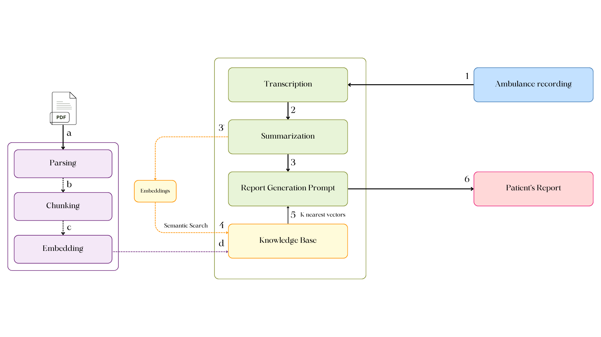

# 🚑 Ambulance-ER-PreArrival-Sync-Powered-by-LLM

## 🏥 Project Overview

This project enables real-time synchronization between ambulance teams and ER doctors by transcribing ambulance conversations and summarizing key medical details. It ensures that ER personnel receive critical patient information before arrival, enhancing preparedness and response time.

---

## ✨ Features

- **🎙️ Real-Time Speech-to-Text**: Converts ambulance conversations into structured text using Whisper (ASR).
- **📄 Medical Summary Generation**: Summarizes patient details and emergency levels using Llama.
- **📡 Data Transmission**: Sends transcriptions and summaries to ER staff for quick decision-making.
- **📑 Report generation** : Generates a comprehensive patient report with treatment recommendations.
- **💻 Web Dashboard**: Displays transcriptions and summaries in an intuitive, structured format.

---

## 🏗️ Architecture Overview

<picture>
     <source media="(prefers-color-scheme: dark)" srcset="assets/Architecture-dark.png">
     <source media="(prefers-color-scheme: light)" srcset="assets/Architecture-light.png">
     
</picture>

### 🔹 How It Works

1️⃣ **Voice Discussion**: The system captures conversations (e.g., between medical staff).  
2️⃣ **Transcription**: Converts speech into text using an AI-based transcription tool.  
3️⃣ **Summarization & Information Extraction**: Extracts key medical details.  
4️⃣ **Semantic Search in Knowledge Base**: Retrieves relevant documents for context.  
5️⃣ **Report Generation Request**: Creates structured patient reports based on retrieved data.  
6️⃣ **Patient Report Generation**: Produces a final report for emergency or medical use.

➕ Additionally, the system processes PDFs using:

- **Parsing**: Extracting text from medical documents.
- **Chunking**: Splitting text into meaningful segments.
- **Embedding**: Storing text as vectors for advanced search capabilities.

## 🛠️ Technologies Used

- **Programming Language**: Python 🐍
- **Generative AI**: Whisper (ASR) for speech-to-text, Llama for summarization and report generation 🧠
- **Retrieval-Augmented Generation (RAG) Pipeline**: For enhanced data retrieval 📚
- **Audio Processing**: `pydub` 🎧
- **Frontend**: Streamlit (real-time dashboard) 🌐
- **Deployment**: Virtual environment setup using `venv` or `conda` 🚀

---

## 📁 Project Structure

```
Ambulance-ER-Near-real-time-Synchronization/
├── README.md                   # Documentation
├── app.py                       # Main Flask/Streamlit application
├── assets/
│   └── styles.css               # CSS for web interface
└── utils/
    ├── Generator.py             # Generates a global patient's report and treatment recommendations
    ├── Processor.py             # Processes transcribed text for analysis
    ├── Summarizer.py            # Summarizes patient situation & emergency level
    └── Transcripter.py          # Converts audio to text using ASR

```

---

## 🚀 Installation

### 🔹 1. Clone the Repository

```bash
git clone https://github.com/AnasBenAmor10/Ambulance-ER-PreArrival-Sync-Powered-by-LLM.git
cd Ambulance-ER-PreArrival-Sync-Powered-by-LLM
```

### 🔹 2. Create a Virtual Environment

```bash
python3 -m venv myenv
source myenv/bin/activate  # Windows: myenv\Scripts\activate
```

### 🔹 3. Install Dependencies

```bash
pip install -r requirements.txt
```

### 🔹 4. Set Up Environment Variables

Create a `.env` file with:

```
GROQ_API_KEY=your_groq_api_key
PINECONE_API_KEY=your_pinecone_api_key
```

---

## ⚙️ How It Works

1. **Transcripter.py** captures and converts ambulance audio to text using the Whisper model.
2. **Processor.py** cleans and structures the transcribed text for medical analysis.
3. **Summarizer.py** generates a medical summary and emergency assessment using Llama.
4. **Generator.py** produces a detailed patient report and treatment recommendations.
5. **app.py** displays results on a web interface for ER staff, utilizing Streamlit for real-time updates.

---

## 🏃 Running the Application

### ➤ Start the Web Server

```bash
streamlit run client/app.py
```

Visit `http://127.0.0.1:8501/` in your browser to see the dashboard.

### ➤ Run Individual Modules

- **Test Speech-to-Text**

```bash
python utils/Transcripter.py sample_audio.wav
```

- **Generate Summary from Text**

```bash
python utils/Summarizer.py "Patient is experiencing chest pain and difficulty breathing."
```

---

## 🤝 Contributing

1️⃣ **🍴 Fork the repository** – Click the fork button to create a copy in your GitHub account.  
2️⃣ **🌱 Create a new branch** – Work on your improvements in an isolated branch.  
3️⃣ **📩 Submit a Pull Request (PR)** – Open a PR to propose your changes for review.